  

 

 

  <b>A premium FastFlag manager giving you complete control over Roblox — built for everyone.</b> 
  Forked from <a href="https://github.com/4anti/Roblox-Fastflag-Manager">4anti/Roblox-Fastflag-Manager</a> and significantly improved.

---

## ✨ Features

| | Feature | Description |
|:---:|:---|:---|
| ⚡ | **Instant Indexing** | Search thousands of FFlags in milliseconds |
| 🛠️ | **Smart Presets** | Create, merge, and toggle complex configurations instantly |
| 🎮 | **Keybind System** | Assign hotkeys to toggle or cycle FFlags mid-game |
| ⛑️ | **Bootstrapper Support** | Works with Bloxstrap, Voidstrap, Fishstrap, and more |
| 🔄 | **Manual / Auto Updates** | Full control over how and when you update |
| 🎨 | **Premium UI** | Glassmorphism, custom themes, image backgrounds, smooth animations |
| ↩️ | **Deapply System** | Instantly revert all applied FFlags back to default |
| 🔒 | **Secure Injection** | Reliable, trace-free deployment — even during active gameplay |
| 📦 | **No Setup Required** | Single `.exe` — no Python, no dependencies |

---

## 🌿 Bootstrapper Support

| Bootstrapper | Supported |
|:---|:---:|
| Bloxstrap | ✅ |
| Voidstrap | ✅ |
| Fishstrap | ✅ |
| Others | ✅ |

---

## 📥 Installation

1. Head to the **[Releases](../../releases)** page
2. Download the latest `FastFlag+ Manager.exe`
3. Run it — that's it

---

## 🎮 Usage

| Step | Action | Description |
|:---:|:---|:---|
| 1 | **Search** | Find FFlags by name or browse by category |
| 2 | **Presets** | Build preset configs, drag to reorder priority |
| 3 | **Keybinds** | Bind hotkeys to toggle flags instantly while in-game |
| 4 | **Apply** | Inject your config into the Roblox client |
| 5 | **Deapply** | Roll back everything to default in one click |

---

## ⚖️ License

All rights reserved. Unauthorized redistribution or modification of this software is prohibited.

---

  Built with ❤️ for the Roblox community.

